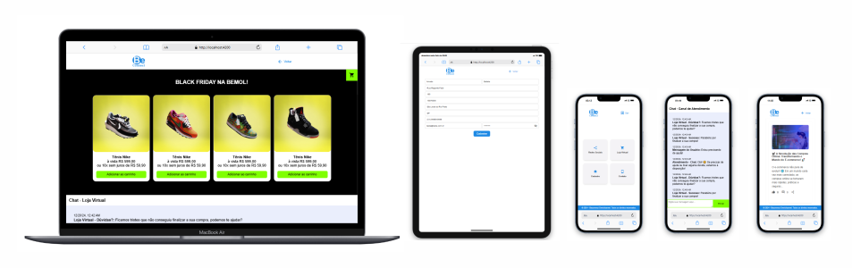

# ⚡ Projeto
## 🚀 Bem-vindo ao projeto Software Omnichannel BeConnect! 
### Este é um projeto desenvolvido em Angular. 
## Pré-requisitos

Antes de começar, certifique-se de ter o Node.js e o npm instalados em seu ambiente de desenvolvimento.

- Node.js: [Baixar Node.js](https://nodejs.org/)
- npm (gerenciador de pacotes do Node.js): Geralmente instalado junto com o Node.js

## Funcionalidades

- **Persistência de Dados**: Utiliza `localStorage` e `sessionStorage` para salvar e persistir dados no navegador.
- **Responsividade**: Projeto otimizado para diferentes tamanhos de tela, proporcionando uma experiência fluida em dispositivos móveis, tablets e desktops.
- **SPA (Single Page Application)**: Aplicação com navegação sem recarregamento de página.
- **Componetização**: Estrutura de componentes reutilizáveis e modulares.
- **Omnichannel**: O projeto captura interações do usuário através de curtidas, comentários e cliques nas interações nas redes sociais, no cadastro, na loja virtual e no chat e as envia para um chat que exibe mensagens de interação, proporcionando uma experiência personalizada e imersiva ao usuário.
**Interação**: A interação entre os canais A (tela de login) e B (tela de cadastro) é projetada para ser contínua e sem interrupções. Caso o usuário inicie um processo de login e, por algum motivo, precise passar para a tela de cadastro, os dados inseridos no canal A são automaticamente transferidos para o canal B, garantindo que ele não precise repetir informações já fornecidas. Essa transição fluida melhora a experiência do usuário, permitindo que ele continue seu fluxo sem perder dados e sem a necessidade de reiniciar a interação, promovendo uma navegação eficiente e simplificada entre as etapas de login e cadastro. E também de eventos que ocorrem em  canais e são apresentados nos outros canais.

## Instalação

1. Instale as dependências necessárias do projeto utilizando npm:

   ```bash
   npm install 

      
2. Para iniciar o servidor de desenvolvimento do Angular e visualizar o projeto:

   ```bash
   ng serve




## Créditos das Imagens
As imagens utilizadas neste projeto foram obtidas na [Pexels](https://www.pexels.com).
